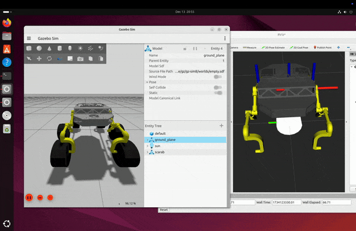

# Marsworks Scarab ROS2 Workspace

This repository contains the ROS2 workspace for simulating the Marsworks Scarab rover using Gazebo.

## Overview

The Marsworks Scarab project focuses on developing a robotic system for Mars exploration. This workspace provides the necessary packages and configurations to simulate the Scarab rover in a Gazebo environment using ROS2.

<center>  </center>

## Prerequisites

- ROS2 (Foxy or later recommended)
- Gazebo
- Ubuntu 20.04 or later

## Installation

1. Clone the repository:

   ```bash
   git clone https://github.com/renzodamgo/marsworks_scarab_ws.git
   ```

2. Navigate to the workspace:

   ```bash
   cd marsworks_scarab_ws
   ```

3. Install dependencies:

   ```bash
   rosdep install --from-paths src --ignore-src -r -y
   ```

4. Build the workspace:
   ```bash
   colcon build
   ```

## Usage

1. Source the workspace:

   ```bash
   source install/setup.bash
   ```

2. Launch the Scarab rover simulation:
   ```bash
   ros2 launch rover_bringup simulated_robot.launch.py
   ```

## Project Structure

```
└── src
    ├── rover_bringup
    │   ├── launch
    │   │   ├── real_robot.launch.py
    │   │   └── simulated_robot.launch.py
    │   └── ...
    └── rover_description
        ├── launch
        │   ├── display.launch.py
        │   └── gazebo.launch.py
        ├── meshes
        │   ├── base_link.stl
        │   ├── suspension_left_link.stl
        │   └── suspension_right_link.stl
        ├── rviz
        │   └── display.rviz
        ├── urdf
        │   ├── materials.xacro
        │   └── robot.urdf
        └── worlds
            ├── empty.sdf
            └── wro_world.sdf
```

- `rover_bringup`: Contains launch files for both simulated and real robot scenarios.
- `rover_description`: Includes URDF files, mesh files, and world descriptions for Gazebo simulation.

## Acknowledgments

- Marsworks team
- ROS2 community
- [Jan](https://github.com/JanUniAccount) for providing the [original Mars rover simulation](https://github.com/JanUniAccount/mars_rover_pkg) in ROS1, which served as the foundation for this ROS2 implementation
